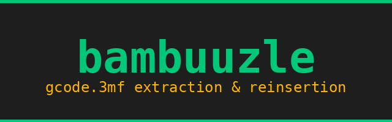

# bambuuzle

[](https://badge.fury.io/py/bambuuzle)
[](https://pypi.org/project/bambuuzle/)
[](https://opensource.org/licenses/MIT)
[](https://pypi.org/project/bambuuzle/)

Extract and re-insert G-code from Bambu Lab `.gcode.3mf` files.



## What is this?

Bambu Lab printers use `.gcode.3mf` files — which are just ZIP archives containing G-code, metadata, thumbnails, and MD5 checksums. **bambuuzle** lets you:

- **Extract** plate G-code for editing
- **Re-insert** modified G-code (with automatic MD5 recomputation)
- **Create** `.gcode.3mf` files from scratch
- **Programmatically transform** G-code via the Python API

Zero dependencies — uses only Python stdlib (`zipfile`, `hashlib`, `json`).

## Installation

```bash
pip install bambuuzle
```

## CLI Usage

### Extract G-code from a plate

```bash
# Extract plate 1 (default) → writes plate_1.gcode
bambuuzle get_plate my_print.gcode.3mf

# Extract plate 2 → writes plate_2.gcode
bambuuzle get_plate my_print.gcode.3mf --plate 2
```

### Re-insert modified G-code

```bash
# Edit plate_1.gcode however you like, then:
bambuuzle put_plate my_print.gcode.3mf

# Write to a new file instead of overwriting
bambuuzle put_plate my_print.gcode.3mf --output modified.gcode.3mf
```

The MD5 checksum is automatically recomputed — no manual hash wrangling needed.

## Python API

### Read and modify

```python
from bambuuzle import BambuFile

bf = BambuFile.open("my_print.gcode.3mf")

# Access plate gcode
plate = bf.plate(1)
print(f"Gcode length: {len(plate.gcode)} chars")

# Modify
plate.gcode = plate.gcode.replace("M104 S200", "M104 S210")

# Save (MD5 auto-recomputed)
bf.save("modified.gcode.3mf")
```

### Create from scratch

```python
from bambuuzle import BambuFile

bf = BambuFile()
bf.add_plate(gcode="G28\nG1 X100 Y100 F3000\nM84\n")
bf.save("new_print.gcode.3mf")
```

### Transform helper

```python
from bambuuzle.bambu_file import transform

def add_pause_at_layer(gcode: str) -> str:
    return gcode.replace(
        "; LAYER_CHANGE",
        "; LAYER_CHANGE\nM400\nM25 ; pause",
        1,  # only first occurrence
    )

transform("input.gcode.3mf", "output.gcode.3mf", add_pause_at_layer)
```

## The .gcode.3mf format

A `.gcode.3mf` is a ZIP archive with this structure:

```
├── [Content_Types].xml
├── _rels/.rels
├── 3D/3dmodel.model
└── Metadata/
    ├── plate_1.gcode          ← The actual G-code
    ├── plate_1.gcode.md5      ← MD5 hex digest (must match gcode)
    ├── plate_1.json           ← Plate metadata
    ├── plate_1.png            ← Thumbnail
    └── ...
```

**Key gotcha**: if the MD5 doesn't match the G-code, Bambu Studio and the printer will reject the file. bambuuzle handles this automatically.

## Development

```bash
git clone https://github.com/retospect/bambuuzle.git
cd bambuuzle
pip install -e ".[dev]"
pytest
```

## License

MIT
